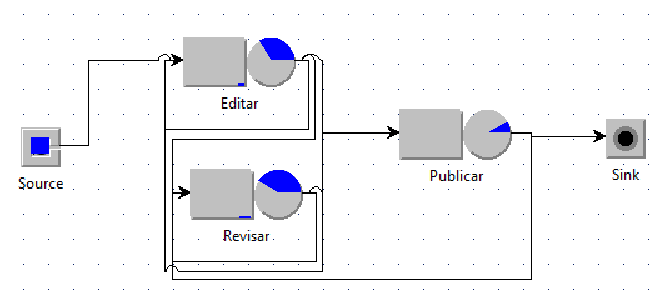
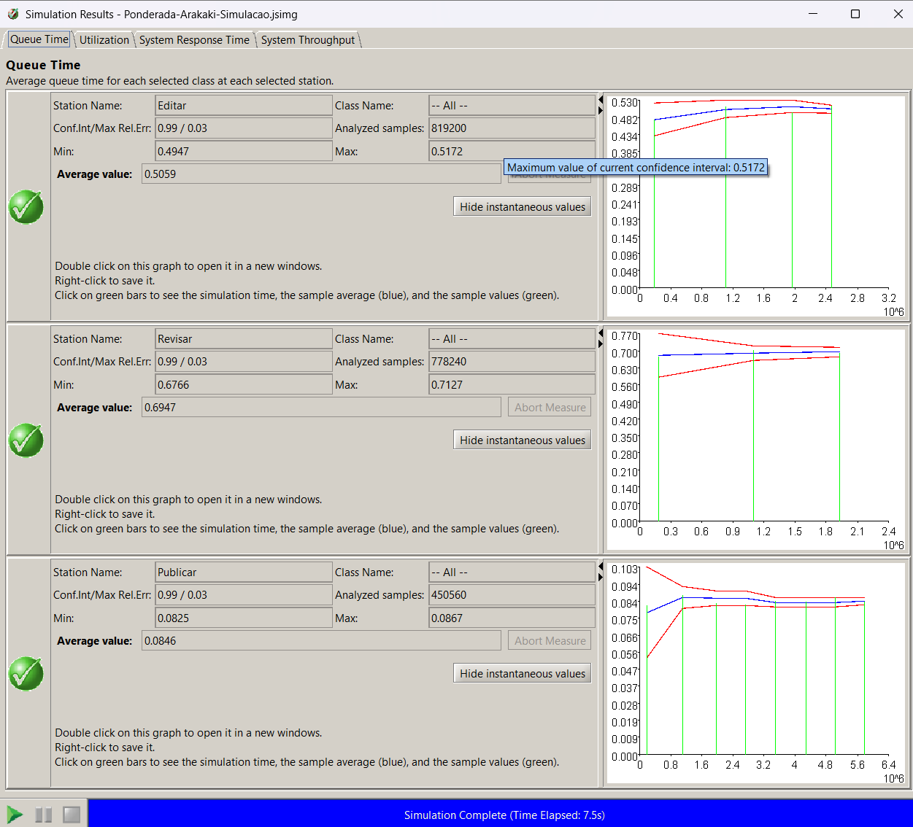

# Ponderada Simulação de Redes de Filas com JMT 
Nesta ponderada, modelei de forma simples os processos de submissão de documentos do Portifólio Metro SP usando o Java Modeling Tools (JMT) conforme a aula e os auto estudos.

## Contexto

O processo real tem três etapas principais — Editar → Revisar → Publicar — com loops de retrabalho (ficar mais tempo editando/revisando) e, às vezes, devolução após publicar. Eu quis medir, de forma simples, vazão, tempo total por documento e onde nasce a fila.

> Link do vídeo: https://www.youtube.com/watch?v=onWy7vdnGBA

> Link do arquivo de simulação: [./Ponderada-Arakaki-Simulacao.jsimg](./Ponderada-Arakaki-Simulacao.jsimg)
## Como desenvolvi o simulador

* Modelei uma rede de filas aberta com Source → Editar → Revisar → Publicar → Sink.
* Criei a classe aberta Docs (chegada média constante).
* Usei filas FCFS com tempos de serviço exponenciais por etapa.
* Programei o roteamento probabilístico AS-IS (auto-laços em Editar/Revisar e chance de Publicar voltar para Revisar).
* Coletei métricas nativas do JMT: System Throughput, System Response Time, Utilization e Queue Time por estação.

## Resultados (AS-IS)

> Acima está um print de somente a métrica "Tempo em fila" (Queue Time) para cada estação. As demais foram mostradas no vídeo.

* Throughput do sistema: 0,0669 doc/min (~4,0 doc/h).
* Tempo médio ponta-a-ponta: 19,27 min por documento.
* Utilização média por servidor: Editar = 0,337, Revisar = 0,415, Publicar = 0,078.
* Tempo médio de espera em fila: Editar = 0,492 min, Revisar = 0,703 min, Publicar = 0,084 min.

Leitura: a vazão acompanha a chegada (sistema estável). O tempo total é puxado para cima pelos loops que concentram carga em Revisar, que aparece como gargalo relativo (maior utilização e maior fila). Pela Lei de Little (L = λ × W), os números se mantêm coerentes.
